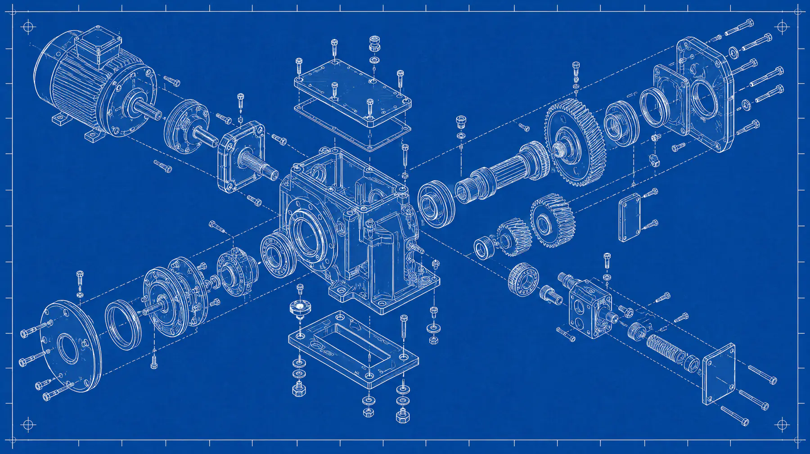
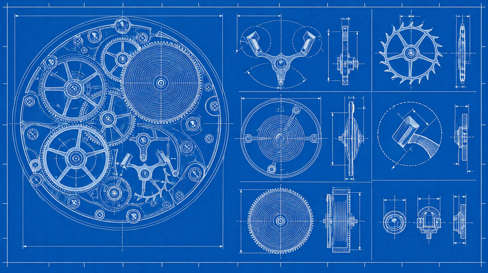

I started to fall in love with programming on the brink of the AI boom.
This was a few years before the bombshell of GPT-3 dropped and on honest introspection, I've realized that a lot of what I have been doing since the rise of Agentic Engineering has clear and profound foundations from when I programmed by hand.
Me writing a text editor for Windows using Python on Sublime Text or hand writing a weird S3 like service using weird file pointer mechanics 2 years ago has probably been the very pillar holding up my fickle Claude and Caffeine powered Frankenstein creations.

While Agent Engineering has fundamentally changed my horizons of thinking and has a very meaningful impact on everything that I build, work on and even think about, I think it has wired my brain to crave instant gratification via code as opposed to sustained pleasure through hacking away at something.
I think this can be (badly) compared to engine oil.
While you probably never have to keep changing the engine oil as frequently as you refill your tank (if you are, take your car to the mechanic), it is fundamentally the thing that lets your engine even use the gas you pump it with.
No matter how many miles you are able to pump out with essentially unlimited gas, you would eventually be bottlenecked by your supply of engine oil.

This was my weird way of saying that I believe you need fuel to keep the Agentic Engineering system going.
I like to think there is a hedonistic and a mindful side to programming with LLM harnesses.
I've tried being on both sides of the aisle and it's honestly not that bad on the hedonistic side. We are objectively reaching the singularity and the models we have right now are probably enough to take us a very long way. However, that's exactly the point.
Hedonism is not constrained by progress, rather *supplemented* by it.
It's easier to lay on bed and pass the day away with access to the internet and the whole digital world as opposed to without it.
It's easier to just let Claude Code make all the architectural decisions for your project and most likely they are not going to be objectively shitty. They will probably be better solutions to the problem than you could conjure up given the amount of time you give the LLM. That is something that baffled me when I thought about it. I was mad at Claude Code for an architectural decision it made by "Clauding" for 180 seconds. That's it! If you ask someone with years of compounding thought processes and skills to take an architectural decision, they would probably "Get back to you" on it and that's not a bad thing mind you!
However, that's also the trap that is extremely easy to fall into.
**To stop thinking and to start expecting.**
This however is not to paint LLM companies in a bad light.

> Production code written by Claude should have a higher bar than if it was written by a human
>
> — [@bcherny](https://x.com/bcherny/status/2098217573276131577)

This is something that resonates with what I think.
That's why, when someone blames bad code on their LLM model, I believe that's a wrong way to think about it. LLMs are supposed to increase our potential, not eat at it!

For the mindful way of Agentic Engineering, I honestly have a lot of ideas that I want to try out.
I am figuring it out as I go and I believe that's the entire point.
One observation however has been that I'm starting to feel the little joys of programming come back to me.
By *little joys* I mean the stuff that I actually enjoyed. You know that feeling you get when you get the system just right? When everything falls in place right like that simulation in your brain? Yeah the hedonistic side takes away that little simulation in your brain in the first place and without it, you are left on a floating piece of paradise with nothing to support it.

This is not to say however that I am completely writing code by hand again. The reason I am able to spend so much time hand writing this article is because my agent's running in the background and I think that's a fucking beautiful thing.
I am however going to start being mindful of what I am programming. This doesn't mean I am limiting my horizons when I am programming with my agents, but rather dividing it. I do plan on aiming for the sky, however reach it with well thought out decisions and clear direction as opposed to running on angry prompts and "code with a few caveats".
That is not to say all the systems I've built till now are wrong nor the ones I will build now will be perfection, it's just that the way I build them will be different. *Self sustaining, both intellectually and spiritually.*

Kinda proud of myself for being able to write this article without LLMs haha.
